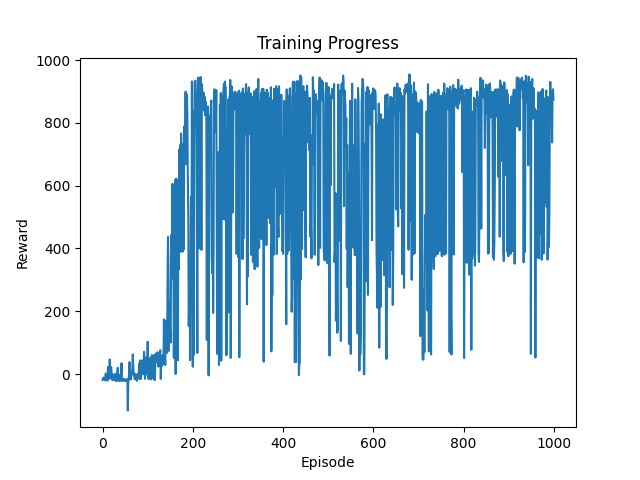
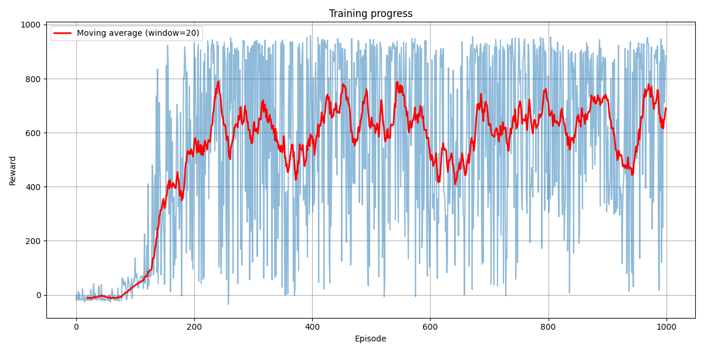
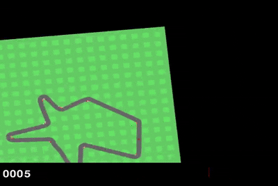
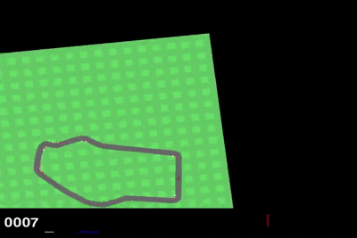
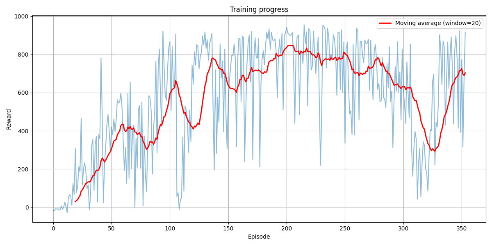
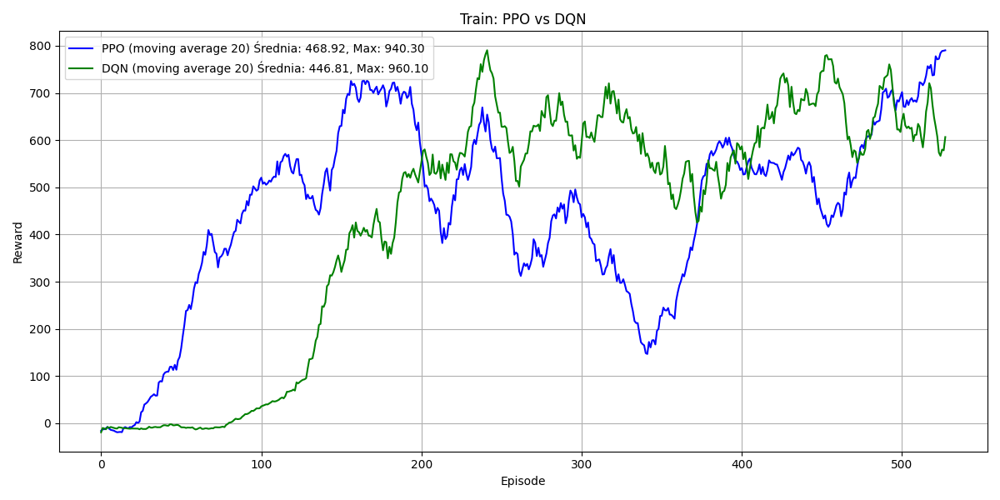

# Reinforcement Learning Algorithms: DQN and PPO in Car Racing Environment

**Authors:**
* Marcin Mazuro
* Kacper Kozak

## Introduction
The goal of the project is the implementation of two popular algorithms in machine learning:
* **Deep Q-Learning (DQN)**
* **Proximal Policy Optimization (PPO)**

These were tested in the simulated **CarRacing** environment provided by the OpenAI Gym library. This environment serves as a simplified car driving simulator on a generated track, presenting a good challenge for RL algorithms.

For implementation, the **PyTorch** library was used, which is commonly employed in machine learning solutions.

The aim of the experiment was to examine the efficiency of both algorithms regarding the quality of obtained results, learning speed, and training stability.

## Environment Description
The agent controls a car tasked with driving through a generated track as fast as possible, covering as large a fragment of it as possible within a limited time.

### Environment Features

* **Observations:** The agent receives an image in RGB format with dimensions of 96×96 pixels, representing a top-down view of the track and the car. This means the state space is visual and continuous.

* **Actions:** The action space can be continuous or discrete.
    * **Continuous**:
        * Steering (value from -1 to 1)
        * Acceleration (gas; value from 0 to 1)
        * Brake (value from 0 to 1)
    * **Discrete**:
        * Do nothing
        * Turn left
        * Turn right
        * Acceleration
        * Brake

* **Rewards:**
    * The agent receives a penalty of -0.1 points every frame (every simulation step).
    * It receives a reward of $1000/N$, where $N$ is the number of track tiles the agent has driven over. This means the agent is rewarded for driving through as much of the track as possible in the shortest time.
    * Additionally, an extra reward for using acceleration was introduced to improve the training process, as the agent stood still for most of the time initially.

* **Agent Goal:** The agent is tasked with learning to effectively navigate the track, maximizing the sum of rewards by efficiently negotiating corners, avoiding going off-track, and maintaining optimal speed.

## CNN Network
In this environment, the observation space consists of images. This means that to find the optimal action for a given state, these images must first be processed. **Convolutional Neural Networks (CNN)** serve this purpose best, as they can effectively extract local features from the image, such as track edges, curves, and car position.

First, preprocessing must be performed to facilitate the network's task. This consists of:
* Rescaling the image from 96x96 to 84x84 to reduce complexity.
* Converting RGB to grayscale, as colors are not needed.
* Normalization from values [0, 255] to [0, 1].
* Stacking the last 4 frames to allow motion detection.

The input to the network is the game state, i.e., 4 frames of size 84x84. These pass through **convolutional network layers**, which extract the most important information about the image, such as track edges or car location. Subsequently, they create a **feature vector**, which is information about the current state.

Based on this, the **network output** is created:
* In the case of the **DQN** algorithm, this is the **Q-value** for each action.
* In **PPO**, two networks are used which differ in their output: the **Actor** and the **Critic**. The Actor's outputs are **logits for actions**, and the Critic's output is the **state evaluation V(s)**.

## DQN Algorithm

### Description
Deep Q-Network (DQN) is one of the most significant reinforcement learning algorithms, combining classic Q-learning with deep neural networks. DQN utilizes two networks:

* **Policy network:** Updated in every iteration.
* **Target network:** Copied from the Policy network periodically.

This mechanism helps avoid instability during training (the moving target problem).

The goal of DQN is to teach the agent the value function $Q(s, a)$, which assigns a value to every possible action $a$ in a given state $s$, representing the expected sum of rewards from that moment into the future. Thanks to this function, the agent selects actions that maximize this value.

### Algorithm Process
The algorithm proceeds as follows:

1.  Reset the environment and obtain the initial state $s$.
2.  **Action Selection:** With probability $\epsilon$, choose a random action $a$, or choose the best possible action $a$ for the current state $s$. Depending on the value of $\epsilon$, we can prioritize either **exploration** or **exploitation**.
3.  Execute action $a$ and receive the new state $s'$ and reward $r$.
4.  Save the experience $(s, a, r, s')$ to the experience replay buffer.
5.  **Network Training:** Sample a mini-batch from the experience buffer and calculate the target value using the Bellman equation:

$$Q^*(s_t, a_t) = r_t + \gamma(1 - d) \max_{a} Q(s_{t+1}, a_{t+1})$$

6.  Calculate loss using **MSE** (Mean Squared Error).
7.  Update network weights using the **Adam** optimizer.
8.  Decay $\epsilon$.
9.  Every few steps (e.g., 1000), copy the main network weights to the target network.

### Experiment Details
Training was conducted for 1000 episodes on a single track, and a second training session was performed for 1000 episodes on randomly generated tracks.

### DQN Results
* **Episode 5:** Agent is just learning movement.
  

* **Episode 80:** Agent smoothly passes the first corner but later falls off the track.
  

* **Episode 150:** Agent can return to the track after falling off but still struggles with corners.
    

* **Episode 600:** Agent smoothly and quickly completes the entire track.
    

### DQN Conclusions
  

The graph shows the reward obtained in each episode during training on a single track.
* Until episode 100, progress is very slow. This is the **exploration phase**.
* Subsequently, the $\epsilon$ value drops below $\epsilon_{min}$, and the agent transitions to the **exploitation phase**. The period between episode 100 and 200 marks significant progress.
* Later, training stabilizes at a reward value of approx. 900, which appears to be the maximum.

However, a flaw in the DQN algorithm is observable: it is **unstable**. Despite many episodes, the agent still makes mistakes and achieves low rewards due to falling off the track or skidding. This effect can be minimized by tuning hyperparameters such as $\epsilon$, learning rate, replay buffer size, and target network frequency.

  

Interestingly, the DQN model trained on random tracks achieves results very similar to the model trained on a single track, suggesting it can effectively **generalize** its strategies to different environment layouts. This indicates the network learned general driving rules rather than specific features of a single track.

## PPO Algorithm
**Proximal Policy Optimization (PPO)** is a modern and stable policy gradient reinforcement learning algorithm developed by OpenAI. It is often used in environments with continuous actions because it handles policy optimization well without the risk of excessively large updates that could destabilize training.

* **Direct Policy Optimization:** The algorithm learns a strategy (policy), rather than a value function $Q(s, a)$ as in DQN.
* **Stability via Clipping:** PPO applies **clipping** to prevent drastic policy changes after a single update.
* **Versatility:** Supports environments with both continuous and discrete action spaces.

### Actor-Critic Architecture
In this approach, the agent utilizes two neural networks:
1. **Actor** — Policy $\pi(a | s)$: Tells the agent which action to take in a given state, learning to maximize rewards. It represents the probability of choosing action $a$ from state $s$.
2. **Critic** — Value function $V(s)$: Evaluates how good a given state is (whether it leads to a high reward) and helps the actor by providing an error signal (advantage). It contains the expected sum of future rewards if the agent starts in state $s$ and acts according to policy $\pi$.

The Actor selects an action, and the Critic evaluates if it was a good decision. Both learn together, creating a more stable algorithm.

### Algorithm Process
The algorithm proceeds as follows:
1. **Collect data (rollout):** For several steps, observe state $s$, choose action $a$ from the old policy $\pi$, and save to a batch. Action selection is stochastic; actions that seem better have a higher probability of being chosen.
2. **Calculate return:** Based on rewards and the gamma coefficient.
   $$G = \sum_{t=0}^{T} \gamma^t r_t$$
3. **Calculate state value $V(s)$** using the Critic.
4. **Calculate Advantage** (was the action better than expected?):

$$A^{\pi}(s_t, a_t) := Q^{\pi}(s_t, a_t) - V^{\pi}(s_t)$$

5. **Update Actor and Critic** by passing observation states through the neural network.
6. **Calculate the ratio of new/old probabilities**:

$$r_t(\theta) = \frac{\pi_{\theta}(a_t | s_t)}{\pi_{\theta_{old}}(a_t | s_t)}$$

7. **Calculate clipped loss**, which prevents excessively rapid policy changes:

$$L^{CLIP}(\theta) = \hat{\mathbb{E}}_t \left[ \min \left( r_t(\theta) \hat{A}_t, \text{clip}(r_t(\theta), 1 - \epsilon, 1 + \epsilon) \hat{A}_t \right) \right]$$

8. **Calculate Critic loss** using **MSE**.
9. **Update network weights** using the **Adam** optimizer.

### Experiment Process
Although the number of training episodes was 350, each was accompanied by additional rollouts where the agent explored the environment. As a result, the environment was initialized (reset and run) over 1000 times during the entire training process.

### Experiment Process
Although the number of training episodes was 350, each was accompanied by additional rollouts where the agent explored the environment. As a result, the environment was initialized (reset and run) over 1000 times during the entire training process.

* **Episode 0:** The agent is just learning movement, performing random actions.
    

* **Episode 70:** The agent passes the first few corners but later falls off the track and continues with random actions.
    

* **Episode 145:** The agent can handle falling off the track and has learned to cut sharp corners.
    

* **Episode 200:** The agent completes the entire track very quickly and without issues.
    

* **Episode 225:** The agent conquers even more difficult tracks.
    

### Conclusions
  

**Key Observations:**
* **Initial Phase (Episodes 0–100):** Rewards are low, but a gradual increase is visible. The agent is learning — exploring the environment and improving its policy.
* **Middle Phase (approx. Episodes 100–250):** Significant increase in average rewards — the agent achieves and maintains high efficiency. High instability in raw rewards suggests potential environmental challenges (e.g., randomness).
* **Episodes 250–320:** Distinct drop in results — possible regression in learning or policy interference (e.g., overly aggressive updates). This is typical for PPO if hyperparameters are suboptimal (e.g., optimization step too large or insufficient policy updates).
* **Final Phase (after Episode 320):** Visible improvement — the agent regains its previous level of efficiency.

## Summary: DQN vs PPO Comparison
    

Both applied algorithms — DQN (Deep Q-Network) and PPO (Proximal Policy Optimization) — yielded results allowing for the solution of the set task, yet they demonstrated distinct differences in performance.

* The **DQN-based model** was characterized by a simpler structure and more intuitive implementation, which allowed for obtaining stable, baseline results faster.
* The **PPO algorithm**, representing more advanced policy gradient methods, proved much more difficult to implement and required careful tuning. Although this was our first contact with this class of methods, the PPO implementation ended in full success. Thanks to the accurate replication of key algorithm mechanisms (such as clipping, advantage calculation, or normalization) and precise hyperparameter optimization, the agent trained with the PPO method achieved significantly higher efficiency and better final results than the DQN-based agent.

The experiment thus confirmed the theoretical advantages of PPO and its superiority in solving this type of complex decision-making problem.

### Challenges Encountered
* **Testing:** One of the biggest challenges during the project was testing. The model training process took about **5 hours** before reaching a satisfactory reward level. Such a long training time significantly hindered iterative testing and model modification, requiring careful experiment planning and limiting the possibility of rapid validation of changes.
* **Model Loading:** Another difficulty turned out to be loading trained models. This resulted mainly from the fact that the learning process was time-consuming — models needed many training episodes before they started achieving satisfactory results. In the case of the PPO algorithm, additional problems included technical complications related to saving and subsequently restoring the model state.